# Interview Tracker Website
#### This is a project made under Coding Club IITG.
#### This is a web developement project whihc uses MongoDB, ExpressJS and NodeJS.
#### This uses various important concepts like:
 * User Authentication
 * Routing
 * Model Creation and Data Handling in MongoDB
 * Middlewares
 
#### This contains two major parts:
* User panel
* Admin panel

#### Installation Guidelines:
* Download the code file from github to your local system.
* In your code editor open your terminal with its directory in current project and write 'npm install', now all the necessary packages requires for the project have got installed in your system. 
* Open MongoDB on your web browser and create a collection.
* Now get the url and paste it in the 'dbURI' in the app.js file and you can modify on whichever host you want to connect to.

 ### **User Panel:**
 #### **1. Main Page:**
So, this is the main page of my website which shows all the list of topics and their corresponding subtags on tops with some background images this has basically two features DSA part and the Interview Section Part. The location feature shows the past workplaces where people have worked before.

 #### **2. DSA Page:**
 This page show all the data structures and algorithm contents which are important for interview purpose.
 
 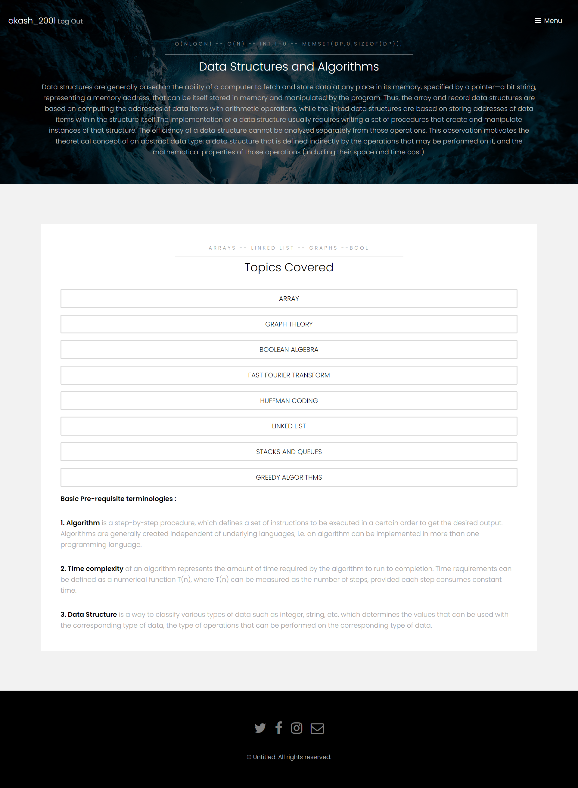
 #### **3.Questions Page:**
 This page contains the question with the corresponding topic along with an 'Add Questions' feature.
 
 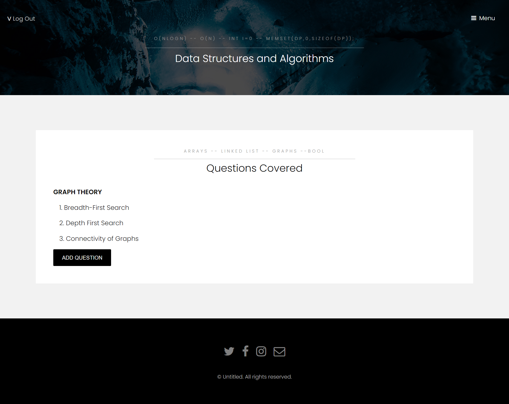
 #### **4. Interview Page(Company Section):**
 This section contains all companies and their corresponding links and experiences. The 'Link to website' redirects you to the companies webpage and 'Learn More' redirects you to the interview section pages. 
 
 
 #### **5. Interview Page(Experience Section):**
 This sections contains all the interview experiences of seniors and here you can add your features through the 'Add Experience' Section.
 
  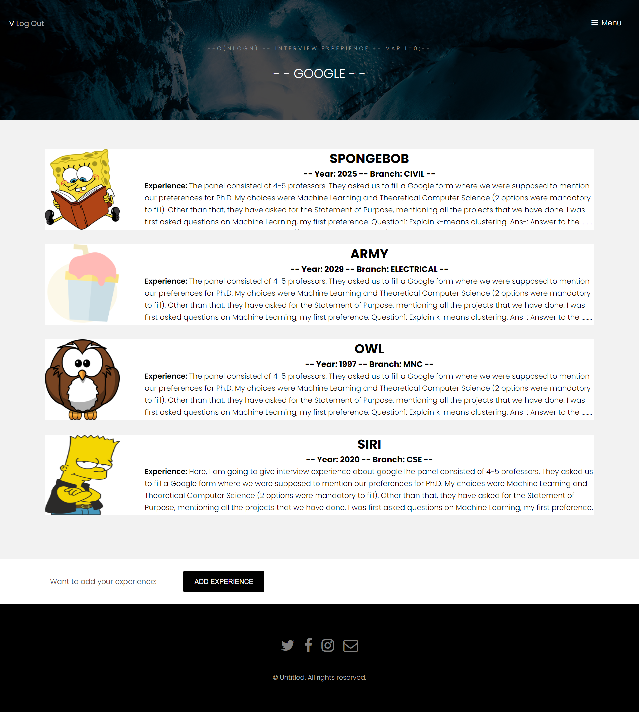
 #### **6. Login Page:**
 This is the user login page.
 
 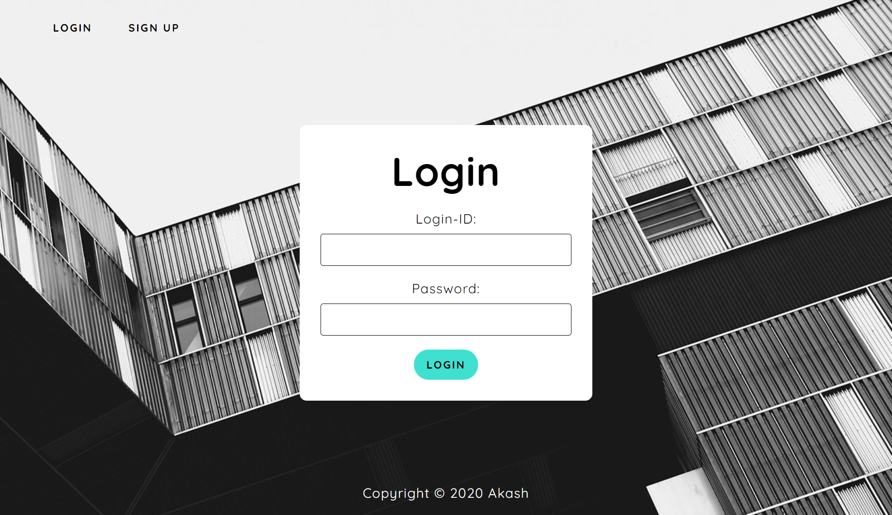
 #### **7. Sign Up Page:**
 This is the user signin page.
 
 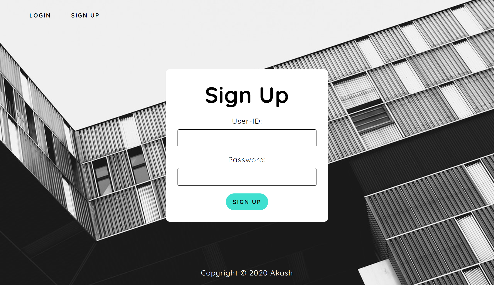
  ### **Admin Panel:**
 #### **1. Main Page:**
So, this is the dashboard of admin webpage which shows all the list of topics, questions, Experience and companies section(This is not made from admin bro I have just taken the template from random website modified it and coded it on my own):

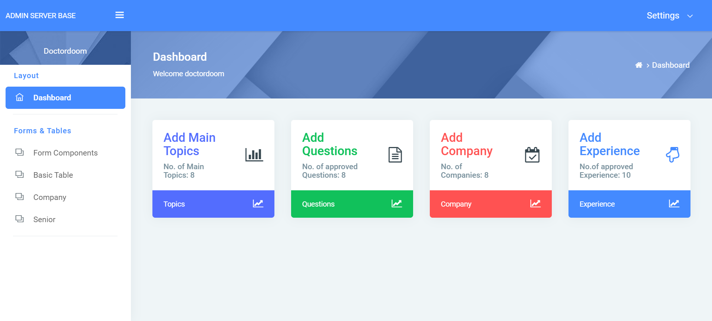

 #### **2. Topics Page:**
 This page contains all the topics:
  
  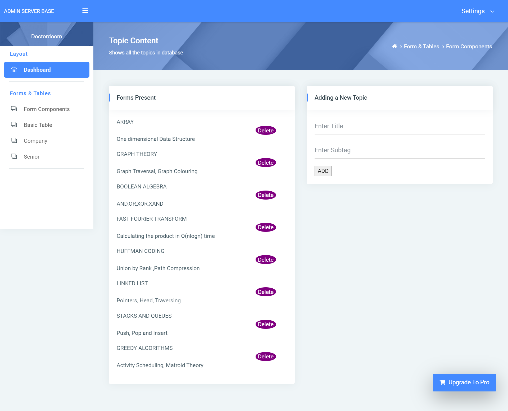
 #### **3. Questions Page:**
 This page contains all the questions:
 
 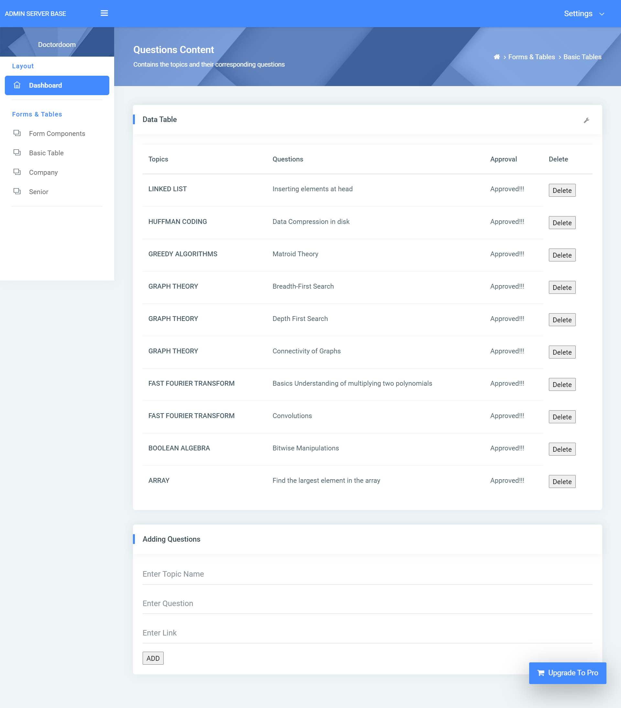
 #### **4. Companies Page:**
 This page contains all the companies:
 
 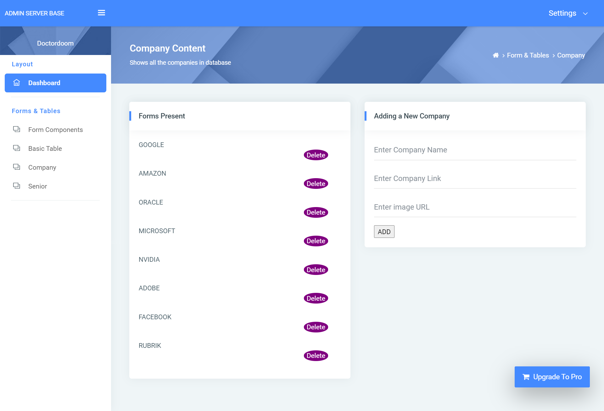
 #### **5. Experience Page:**
 
 This page contains all the past experiences:
 
 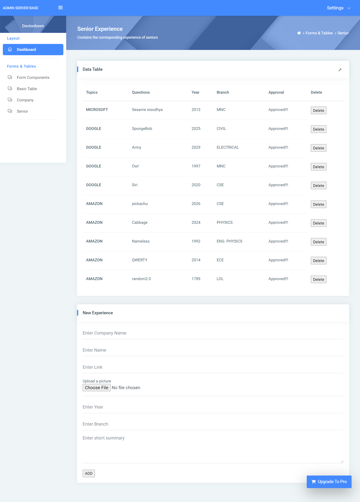
 #### **6. Login Page:**
 This is the admin login page:
 
 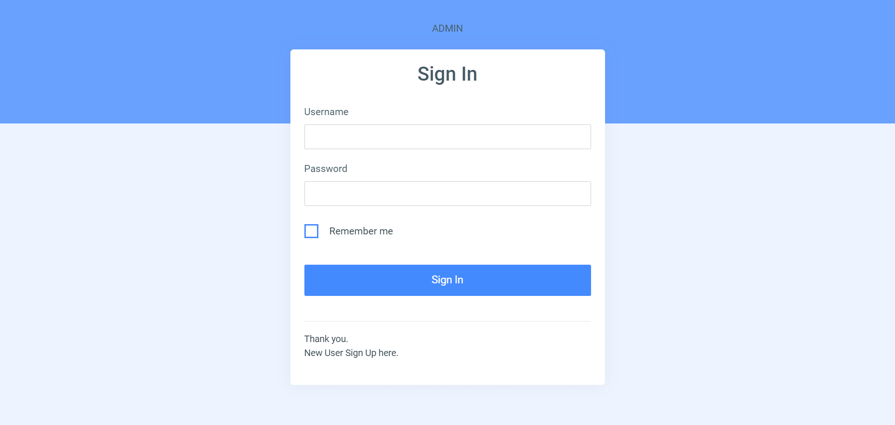
 #### **7. Sign Up Page:**
 This is the admin signup page:
 
 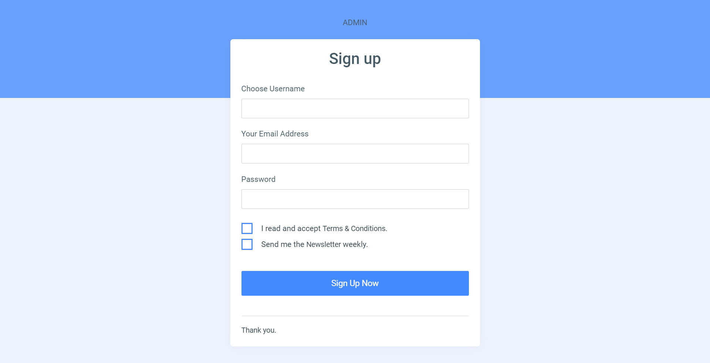
